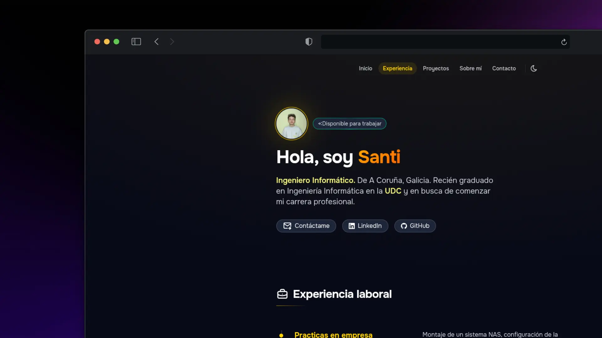

# 👨‍💻 Portfolio personal

Portfolio web personal de **Santiago López Silva**, Ingeniero Informático de A Coruña, Galicia.

El proyecto reúne información sobre mi trayectoria, experiencia, proyectos y tecnologías, además de servir como carta de presentación profesional.

🌐 **Portfolio:** [porfolio-santi](https://porfolio-santi.netlify.app)

<p align="center">
  
</p>

---

## ✨ Características

- Diseño responsive para distintos dispositivos
- Modo claro, oscuro y automático según las preferencias del sistema
- Animaciones y transiciones suaves
- Componentes reutilizables
- Información organizada mediante datos estructurados
- Enfoque en accesibilidad y HTML semántico
- Generación de un sitio estático optimizado para producción

---

## 🛠️ Tecnologías

| Tecnología | Uso |
| --- | --- |
| [Astro](https://astro.build/) | Framework principal |
| [Tailwind CSS](https://tailwindcss.com/) | Estilos y diseño responsive |
| JavaScript | Interactividad |
| HTML | Estructura y contenido |
| Git / GitHub | Control de versiones |

---

## 📁 Estructura del proyecto

```text
Portfolio/
├── public/                 # Recursos estáticos
│   ├── images/
│   └── ...
│
├── src/
│   ├── components/         # Componentes reutilizables
│   ├── data/               # Datos del portfolio
│   ├── layouts/            # Layouts de las páginas
│   ├── pages/              # Páginas y rutas
│   └── styles/             # Estilos globales
│
├── astro.config.mjs        # Configuración de Astro
├── package.json            # Dependencias y scripts
├── tsconfig.json           # Configuración de TypeScript
└── README.md
```

--- 

## 🚀 Instalación 

Para ejecutar el proyecto localmente necesitas tener instalado **Node.js** y **npm**. 

### 1. Clonar el repositorio 
```bash 
git clone https://github.com/santiiloopez/Portfolio.git cd Portfolio 
``` 

### 2. Instalar las dependencias 
```bash 
npm install 
``` 

### 3. Iniciar el servidor de desarrollo 
```bash 
npm run dev 
``` 

El proyecto estará disponible normalmente en: 
```text http://localhost:4321 ``` 

--- 

## 📦 Scripts disponibles 
```bash 
# Iniciar el servidor de desarrollo 
npm run dev 

# Crear una build de producción 
npm run build 

# Previsualizar la build de producción 
npm run preview 
``` 

--- 

## 👤 Sobre mí 

Soy **Santiago López Silva**, Ingeniero Informático por la **Universidade da Coruña (UDC)**, interesado especialmente en el desarrollo de software y la inteligencia artificial. Actualmente busco comenzar mi carrera profesional y seguir desarrollándome en proyectos donde pueda aplicar y ampliar mis conocimientos. 

--- 

## 📬 Contacto 
- 🌐 Portfolio: [porfolio-santi](https://porfolio-santi.netlify.app) 
- 💻 GitHub: [@santiiloopez](https://github.com/santiiloopez) 
- 💼 LinkedIn: [Santiago López Silva](https://www.linkedin.com/in/santiago-lópez-silva-667056274/) 
- ✉️ Email: [santi99lopez@gmail.com](mailto:santi99lopez@gmail.com) 

--- 

## 📄 Licencia 

Este proyecto está disponible bajo la [Licencia MIT](./LICENSE).

--- 

## Autor

Santiago Lopez Silva